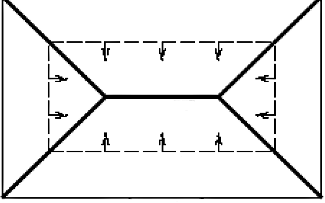

# Introduction
Ce rapport va traiter de l'utilisation de l'algèbre géométrique pour la construction de squelettes topologiques de formes 3D.

Voici un exemple de squelettisation obtenue avec des techniques classiques:


J'ai eu l'idée de ce sujet en suivant le cours de Géométrie discrète du semestre 1. Nous avons vu le principe d'axe médian et ses différentes définitions (feu d'un champ, grossissement de boules maximales...) et j'ai voulu explorer ce que cela pourrait donner en algèbre géométrique avec une métrique C3Ga.

## Exposition du problème

Il existe différentes définitions du squelette topologique. Pour certains auteurs, la notion de squelette est interchangeable avec la notion d'axe médian. D'autres font la séparation entre les deux notions. Pour ce document les deux termes seront équivalents. En effet, la base de mon travail réside dans la recherche de l'axe médian, que j'appelle le plus souvent squelette.
De la même manière, certains auteurs rapprochent l'usage du terme "Amincissement" pour la squelettisation et d'autres auteurs en font deux notions différentes. On parlera ici de la même manière, de squelettisation ou d'amincissement qui désigneront la même chose dans le rapport.

Voici les différentes définitions sur lesquels je me suis appuyé pour effectuer l'exploration :

### Points d'extinction du modèle de propagation du feu.

Prenons le cas 2D pour simplifier la définition. 
Le squelette est construit à partir d'un modèle de propagation de feu. Imaginons un champ d'herbe de la forme de notre forme 2D. On allume un feu en chaque bord. Le squelette est constitué de tous les points d'extinction du feu. 


Sur ce schéma, la ligne grasse représente le squelette résultant d'un rectangle. La ligne en pointillés représente le front de flammes qui progresse. Quand deux fronts de flammes se rejoignent il s'agit d'un point d'extinction.

### Centres de boules maximales/disques maximaux

En 2D nous utilisons des disques mais la méthode reste la même qu'en 3D où les disques sont des boules.

Une boule $B$ est dite maximale dans un ensemble $\Omega$ si elle est contenue dans $\Omega$ et que qu'aucune autre boule $B'$ de $\Omega$ ne contient cette boule. En d'autres termes, toute autre boule $B'$ qui contient $B$ doit nécessairement ne plus être contenue dans l'objet $\Omega$.

Le centre de chaque boule maximale forme les points de notre squelette.


### Centre de boules bitangentes/disques bitangents

C'est une définition assez proche de la précédente. En effet lorsque qu'une boule est maximale elle touche l'objet en au moins 2 points. Le grossissement d'une boule jusqu'à ce qu'elle touche l'objet peut alors être utilisé pour définir un squelette. Ainsi, en récupérant le centre de chaque boule bitangente (ou plus que bitangente), on obtient l'axe médian. 

C'est cette définition assez naturelle dans le cadre de l'algèbre géométrique que nous allons utiliser.


# Analyse algorithmique choisie du problème

Nous avons à notre disposition un maillage 3D. Par rapport à l'algorithme que l'on souhaite implémenter, quelques préconditions doivent être remplies par le maillage afin de pouvoir réaliser un squelette de ce mesh. On supposera que les triangles de notre maillage sont orientés de la même manière, c'est à dire, une convention qui définit un extérieur et un intérieur à notre mesh et que tous les triangles respectent tous la même convention. En effet l'algorithme que je souhaite implémenter repose sur le fait que l'on puisse déterminer que les points sont à l'intérieur ou à l'extérieur de notre objet 3D. Les triangles seront approximés en C3ga par leur cercles circonscrits construits par le wedge des 3 points du triangle `point1 ^ point2 ^ point3`.

Afin de définir si un point appartient ou non à la forme nous allons placer un point que nous savons à l'extérieur du mesh chargé. Une idée pour réaliser ceci est de placer le mesh dans la partie positive du repère et de placer un point dans la partie négative du repère. 
Ce point va servir à la construction d'une ligne avec le point dont on veut tester l'appartenance qui nous donnera un critère d'appartenance à la forme. Si la ligne intersecte un nombre impair de faces de notre mesh, nous avons un point à l'intérieur de notre objet 3D, si le nombre d'intersections est pair alors le point testé est à l'extérieur de notre objet.

Ce test d'appartenance est capital dans la réalisation de notre algorithme. Nous allons effectuer un tirage aléatoire de points. Ce test va permettre d'éliminer les points se situant à l'extérieur de notre objet. Ces points sélectionnés nous serviront pour la construction des boules mentionnées dans la section précédente.

La construction de cet ensemble de points situés à l'intérieur de notre mesh 3D se réalise avec l'algorithme suivant.

```
Entrées: 
N, le nombre de points à selectionner
BorneMax la borne maximale pour choisir les points aléatoire


listePointATester <- ListeVide()
pointFiltrant <- C3gaPoint(-5,-5,-5)
i <- 0


Tant que i est inférieur à N: 
    pointAléatoire <- PointAleatoireEntre(0, BorneMax)
    ligne <- pointFiltrant ^ pointAléatoire ^ ei  
    //Donne une ligne en C3ga entre pointFiltrant et pointAléatoire
    
    nombreIntersection <- 0
    Pour chaque cercle dans la liste des cercles approximant les faces:
        intersection <- Vee(ligne,cercle) 
        // Vee représente l'antiwedge. On peut également le définir par 
        // Dual(Dual(ligne) ^ Dual(cercle))
        Si l'intersection est une sphère duale 
            Alors nombreIntersection <- nombreIntersection + 1
    
    Si nombreIntersection est impair 
        Alors ajouter pointAléatoire à listePointATester

```

Ceci nous donne donc la liste des points à considérer pour faire grossir des sphères.

Pour faire grossir une sphère duale à partir d'un point en C3ga, on peut utiliser la formule suivante :

\begin{equation}
    dualSphere = c - \frac{r^2}{2} * e_i
\end{equation}

où $c$ est le centre de la dualSphere considérée (notre point aléatoire), $r$ est le rayon souhaité.

On souhaite pour chaque étape du grossissement tester la nature de l'intersection entre la sphère (le dual de notre sphère duale) et l'ensemble des faces de notre maillage, c'est à dire un ensemble de cercles.
Afin de calculer l'intersection, nous allons utiliser la formule suivante :

\begin{equation}
    intersection = circle \vee dual(dualSphere)
\end{equation}
qui équivaut à
\begin{equation}
    intersection = dual(dual(circle) \wedge dualSphere)
\end{equation}

Si l'intersection est réelle, on touche le cercle en au moins un point, sinon (intersection imaginaire) on ne touche pas le cercle.

On compte le nombre d'intersection réelle:

- Si le nombre est supérieur ou égal à deux alors nous avons une sphère au moins bitangente. Son centre forme donc un point de notre squelette
- Si le nombre est égal à un, alors la sphère touche qu'une face. Son centre est donc trop proche d'une face et mérite d'être translaté. Pour mon algorithme j'ai décidé d'éliminer les centres qui forme des sphères qui sont tangente en un seul point. En effet cela signifie que la boule n'est pas maximale, elle est contenue dans une autre boule qui possède un autre centre. Je compte sur le fait que ce centre fait partie de mes points aléatoires sélectionnés.
- Si le nombre est égal à 0, la sphère n'a pas encore touché le maillage, il faut continuer de la faire croître.

En pseudo code, l'algorithme devient :

```
listeResultat <- ListeVide()
rayon <- 0.01
Tant que listePointATester n'est pas vide:
    listeCentreSansIntersection <- ListeVide()
    Pour chaque centre dans listePointATester:
        sphereDuale <- centre - (rayon²/2) * ei; 
        listeIntersectionReelle <- ListeVide()
        
        Pour chaque cercle dans la liste des cercles approximant les faces:
            intersection <- Dual(Dual(cercle) ^ sphereDuale)
            Si intersection est une intersection réelle
                Alors ajouter intersection à listeIntersectionReelle
        
        Si listeIntersectionReelle.taille >= 2 
            Alors ajouter centre à listeResultat
        Sinon Si listeIntersectionReelle.taille = 1
            Alors on passe
        Sinon ajouter centre à listeCentreSansIntersection
    
    rayon <- rayon + 0.01
    listePointATester <- listeCentreSansIntersection
```

A la fin de l'algorithme, on obtient une liste de points résultants qui doivent être des points de l'axe médian. 

# Résultats obtenus

J'ai appliqué cet algorithme sur un tétraèdre à base triangulaire, qui est l'objet le plus petit pour l'espace 3D.
Voici le type de résultat que l'on attend pour un squelette de tétraèdre :


# Limites

# Extensions possibles

# Conclusion